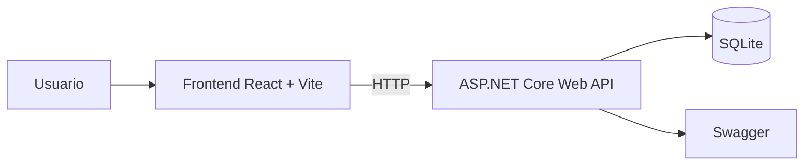

# HistoLinea (PFC DAM)

HistoLinea es una aplicacion web para gestionar eventos historicos y visualizarlos tanto en una lista como en una timeline interactiva.

Autor: Manuel Honrado Vega

## Capturas
- docs/assets/eventos.png
- docs/assets/timeline.png

## Arquitectura

## Stack
Backend
- ASP.NET Core Web API (.NET 8)
- Entity Framework Core 8
- SQLite (desarrollo)
- Swagger (solo en Development)

Frontend
- React 19 + TypeScript
- Vite 5
- Material UI (MUI) 7 + MUI DataGrid
- Axios
- vis-timeline (timeline interactiva)

## Estructura del repositorio
- backend/ -> solucion .NET (Histolinea.sln) y proyectos por capas:
  - Histolinea.Api
  - Histolinea.Application
  - Histolinea.Domain
  - Histolinea.Infrastructure
- frontend/ -> aplicacion React (histolinea-web)
- docs/ -> documentacion del proyecto (incluye contexto y notas)

## Modelo principal
HistoricalEvent
- id (Guid)
- title (string)
- description (string?)
- startDate (DateOnly)
- endDate (DateOnly?)
- imageUrl (string?)
- sourceUrl (string?)
- createdAtUtc (DateTime)

## API (endpoints)
- GET /api/Events -> lista ordenada por startDate
- GET /api/Events/{id} -> detalle
- POST /api/Events -> crear
- PUT /api/Events/{id} -> editar
- DELETE /api/Events/{id} -> borrar

## Requisitos
- Windows 10/11, macOS o Linux
- .NET SDK 8.x (verifica con: dotnet --version)
- Node.js 20+ y npm (verifica con: node --version y npm --version)
- dotnet-ef (solo para aplicar migraciones)

Instalacion de dotnet-ef:
- dotnet tool install --global dotnet-ef

Checklist antes de ejecutar:
- dotnet --version
- node --version
- npm --version
- dotnet ef --version

Descargas oficiales:
- .NET SDK: https://dotnet.microsoft.com/download
- Node.js: https://nodejs.org/en/download

## Arranque rapido (scripts)
En Windows:
1) scripts\run-all.cmd

Reset de base de datos (forzar seed):
- scripts\reset-db.cmd

En Bash:
1) ./scripts/run-all.sh

Reset de base de datos (forzar seed):
- ./scripts/reset-db.sh

Los scripts levantan backend y frontend. La API corre en http://localhost:5273 y el frontend en http://localhost:5173.

## Arranque manual (paso a paso)
Backend:
1) dotnet restore backend\Histolinea.sln
2) dotnet ef database update -p backend\src\Histolinea.Infrastructure -s backend\src\Histolinea.Api
3) dotnet run --project backend\src\Histolinea.Api

Frontend:
1) cd frontend/histolinea-web
2) npm install
3) npm run dev

## Notas
- La base de datos SQLite se crea como histolinea.dev.db en el directorio desde el que se ejecuta la API (los scripts la crean en la raiz del repo).
- Swagger queda disponible en http://localhost:5273/swagger.

## Problemas comunes
- Si dotnet ef no se reconoce, cierra y abre la terminal, o ejecuta dotnet tool update --global dotnet-ef.
- Si el puerto 5273 esta ocupado, cambia el puerto en backend/src/Histolinea.Api/Properties/launchSettings.json.
- Si no ves imagenes, verifica que existen en frontend/histolinea-web/public/images y recarga el frontend.

## Futuras mejoras
- Autenticacion y roles (JWT)
- Filtros avanzados y busqueda por periodos
- Exportacion de eventos (CSV/PDF)
- Edicion por lotes y versionado de cambios
- Soporte multi-idioma (ES/EN)
- Tests unitarios y de integracion
- CI/CD y despliegue automatico
- Modo offline y cache local
